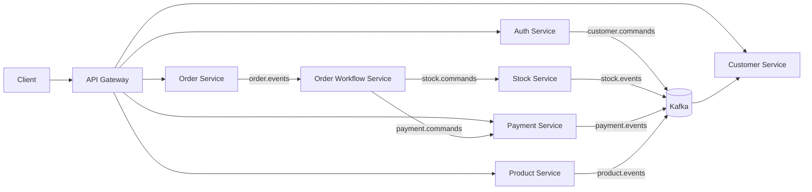

# Event-Driven E-Commerce Backend

Java 21 and Spring Boot 4.1.1 based event-driven e-commerce backend. Each business service owns its own PostgreSQL database and communicates through the API Gateway and Kafka.

The project demonstrates transactional Outbox/Inbox messaging, idempotent consumption, optimistic locking, Saga orchestration, Stripe Checkout, and compensation-based failure handling. The main commerce workflows are validated locally with integration tests and repeatable E2E scripts.

## Business Flow

```text
Cart → Checkout → Order Created → Stock Reserved
     → Payment Awaiting Customer → Payment Completed
     → Stock Confirmed → Order Confirmed → Cart Completed
```

Payment expiry compensation:

```text
Stripe Checkout expires
  → Payment FAILED → Reservation RELEASED
  → Order REJECTED → Cart ACTIVE → Saga FAILED
```

Business reason: `PAYMENT_EXPIRED`.

Out-of-stock compensation:

```text
Stock reservation fails
  → Order REJECTED / OUT_OF_STOCK
  → Cart ACTIVE → Saga FAILED
```

## Services

| Service | Responsibility | Port |
| --- | --- | ---: |
| API Gateway | External HTTP entry point and routing | 4002 |
| Customer Service | Customer and address lifecycle | 4001 |
| Product Service | Product catalog | 4003 |
| Order Service | Cart, checkout, order lifecycle | 4000 |
| Order Workflow Service | Order Saga orchestration and compensation | 4004* |
| Stock Service | Inventory and reservations | 4006 |
| Payment Service | Stripe Checkout and webhooks | 4007 |
| Auth Service | Registration, login, and access JWT issuance | 4008* |

`*` Order Workflow Service and Auth Service ports are internal to Compose. Kafka is available on `9092`; Kafka UI on `4005`.

## Reliability and Consistency

- Database-per-service with Flyway-owned schemas.
- Transactional Outbox and consumer Inbox for reliable, idempotent messaging.
- Kafka consumers designed for at-least-once delivery.
- AuthUser creation and the corresponding Customer command are committed atomically in Auth Service.
- Customer provisioning uses Inbox deduplication and `UNIQUE(auth_user_id)` business protection.
- Saga orchestration with compensation instead of distributed rollback.
- Optimistic locking for carts, stock, reservations, and Saga state.
- Stock validates all requested items before mutating inventory.
- Stripe Checkout creation uses an order-based idempotency key.
- Stripe webhooks verify the `Stripe-Signature` header.

## Architecture



The API Gateway is the public HTTP entry point. Kafka uses at-least-once delivery semantics; consumers are responsible for idempotent processing.

## Auth → Customer Provisioning

Customer creation is initiated by successful Auth registration, not by a public `POST /customers` endpoint:

```text
POST /auth/register
        ↓
AuthUser + CREATE_CUSTOMER_COMMAND Outbox in one transaction
        ↓
Auth Outbox relay → Kafka customer.commands
        ↓
Customer consumer → Inbox deduplication
        ↓
Customer persisted asynchronously
```

`AuthUser.id` and `Customer.id` are separate service-owned identities. Customer Service generates its own Customer UUID and stores the Auth identity as `Customer.authUserId`, which is unique.

## Technology

Java 21 · Spring Boot 4.1.1 · Spring Cloud Gateway WebMVC · Spring Kafka · Spring Data JPA/Hibernate · PostgreSQL 16 · Flyway · Apache Kafka 4.1.1 · Stripe Java SDK 33.4.0 · Docker Compose · Testcontainers 2.0.5 · JUnit · Maven

## Run Locally

Basic prerequisites: Docker Compose, Maven, `make`, `curl`, and `jq`. Stripe CLI and macOS `open` are additionally required only for the Stripe-dependent E2E flows.

Create the uncommitted `payment-service/.env.local` file:

```dotenv
STRIPE_SECRET_KEY=sk_test_<your-test-key>
STRIPE_WEBHOOK_SECRET=whsec_<listener-secret>
```

Create local RSA key files for JWT signing and verification:

```text
~/.ecommerce-keys/private.pem
~/.ecommerce-keys/public.pem
```

The Auth Service reads both keys; the API Gateway receives only `public.pem`. Keep the directory outside the repository and never commit its contents. Never commit real credentials. Start the stack directly with:

```bash
docker compose up -d --build
```

Compose first waits for Kafka to accept admin requests, then `kafka-init` creates and verifies all application topics with their configured partition counts. Kafka broker and consumer topic auto-creation are disabled; Kafka-dependent services start only after `kafka-init` exits successfully.

Kafka topic provisioning is infrastructure-owned. The Compose `kafka-init` one-shot service runs [`infrastructure/kafka/init-topics.sh`](infrastructure/kafka/init-topics.sh), creates and verifies the application topics, and exits before Kafka-dependent services start. Application services do not rely on broker auto-creation or create the Compose topology through KafkaAdmin.

The Gateway is available at `http://localhost:4002`. Common routes are:

```text
GET  /products
GET  /customers/{customerId}
GET  /carts/current?customerId=...
POST /carts/{cartId}/checkout
GET  /orders/{orderId}
GET  /payments/order/{orderId}
POST /auth/register
POST /auth/login
```

Auth registration and login are served through the Gateway. Registration creates a `USER` account, and login returns a short-lived access JWT.

## Authentication and Gateway Security

The Auth Service uses the configured Spring Security `PasswordEncoder` and issues short-lived RS256 access JWTs with:

- issuer: `ecommerce-auth`
- audience: `ecommerce-api`
- subject: AuthUser UUID
- claims: `iat`, `exp`, `jti`, and `roles`

The Gateway is a stateless Spring Security OAuth2 Resource Server. It validates the RSA signature, RS256 algorithm, timestamp/expiration, issuer, and audience. `USER` and `ADMIN` roles map to `ROLE_USER` and `ROLE_ADMIN`.

Gateway authorization rules allow public registration/login, public product GET requests, and the Stripe webhook from the JWT-authentication perspective. Customer, order, cart, and payment routes require authentication; product mutations require `ADMIN`. Other requests are denied.

Business services are not yet independent JWT Resource Servers and resource-level ownership checks are not implemented. Those are planned follow-up work; the current Gateway protects the public HTTP surface.

## Kafka Topology

The primary application topics are:

| Topic | Purpose |
| --- | --- |
| `customer.commands` | Auth-driven Customer provisioning commands |
| `product.events` | Product catalog events consumed by Stock Service |
| `order.commands` / `order.events` | Order commands and lifecycle events |
| `stock.commands` / `stock.events` | Stock reservation commands and results |
| `payment.commands` / `payment.events` | Payment commands and results |

Consumer flows have corresponding `.DLT` topics. The local Compose broker uses three partitions and replication factor one for the current application topology.

## Stripe Local Webhook

The Payment Service itself can start with the Compose stack, but payment completion and expiry E2E scenarios require Stripe test-mode credentials and a local webhook listener. Run this in a separate terminal:

```bash
make stripe-listen
```

It executes:

```bash
stripe listen --latest --forward-to http://localhost:4002/payments/webhooks/stripe
```

Copy the printed `whsec_...` into `payment-service/.env.local` as `STRIPE_WEBHOOK_SECRET`, then restart the Payment Service or run `make e2e-reset`. The listener has been verified with API version `2026-08-26.dahlia`, matching the current Stripe SDK integration.

## End-to-End Testing

The scripts call the Gateway, create a unique Auth user, log in, capture a JWT, poll asynchronous Customer provisioning, and use the resulting Customer ID for authenticated commerce requests. They use read-only development DB queries only for internal states that have no public endpoint. They do not expose `provider_payment_id` through production APIs.

The reusable bootstrap is:

```text
unique email → register → login → JWT
    → poll Customer by email → capture customerId
    → authenticated commerce flow
```

### Reset

```bash
make e2e-reset
```

This removes local Compose volumes, rebuilds services, runs Flyway migrations, verifies deterministic Product/stock seed data, and waits for public Gateway readiness. Use it before a new scenario or after a dirty/partial flow. Customer records are created asynchronously from Auth registration and are not required as seeded E2E data.

### Auth → Customer bootstrap

To verify registration, login, Kafka delivery, and Customer provisioning without Stripe:

```bash
bash -lc 'source scripts/e2e/common.sh && wait_for_gateway && bootstrap_e2e_customer'
```

### Out-of-stock flow

The authenticated out-of-stock flow does not require Stripe. It verifies:

```text
Order REJECTED / OUT_OF_STOCK
Cart ACTIVE
Saga FAILED
```

The request sequence is documented in [`api-requests/README.md`](api-requests/README.md) and the requests are in `api-requests/08-out-of-stock-flow.http`.

### Happy path

With the Stripe listener running:

```bash
make e2e-happy
```

The script registers a unique Auth user, logs in through the Gateway, polls until the Customer is provisioned, and then creates the cart and checkout with the JWT. It waits for the payment and Checkout URL, opens the hosted Stripe page, and verifies the final states. The only manual step is completing payment with test card `4242 4242 4242 4242`, any future expiry, and any CVC; then press ENTER.

Expected result for Product A quantity `2`:

```text
Payment       COMPLETED
Reservation   CONFIRMED
Order         CONFIRMED
Cart          COMPLETED
Saga          COMPLETED
Stock         onHand=98 reserved=0
```

### Payment expiry

With the Stripe listener running and `STRIPE_SECRET_KEY` exported, this flow is automated after checkout creation:

```bash
make e2e-reset
export STRIPE_SECRET_KEY=sk_test_<your-test-key>
make e2e-expiry
```

It creates a real Checkout Session, waits for reservation, reads the real provider session ID from the local Payment DB, expires that exact Stripe Session, waits for the signed webhook, and verifies compensation.

Expected result:

```text
Payment       FAILED
Reservation   RELEASED
Order         REJECTED / PAYMENT_EXPIRED
Cart          ACTIVE
Saga          FAILED
Stock         onHand=100 reserved=0
```

Both scripts use bounded polling, report the last observed state on timeout, and reject dirty seeded state.

## Manual API Requests

[`api-requests/`](api-requests/) contains IntelliJ HTTP Client flows for manual inspection and debugging. [`scripts/e2e/`](scripts/e2e/) contains repeatable full-flow verification. The manual collection has its own [README](api-requests/README.md).

## Testing

The repository includes:

- Domain and web-layer tests
- PostgreSQL/Testcontainers integration tests
- Flyway validation
- Kafka contract and routing tests
- Inbox/Outbox and idempotency tests
- Optimistic-locking and rollback tests
- Saga compensation tests
- Stripe webhook signature tests
- Auth Service PostgreSQL/Flyway integration tests
- Gateway JWT and authorization integration tests
- Real Stripe E2E flows

Run the multi-module suite with Docker available for Testcontainers:

```bash
mvn test
```

## Current State

Implemented and locally verified: Auth Service registration/login and JWT issuance, transactional Auth Outbox, asynchronous Customer provisioning with Inbox idempotency, deterministic Kafka topic initialization, Gateway JWT validation and authorization, cart/checkout, order lifecycle, stock reservation and release, real Stripe Checkout, signed webhook processing, payment-expiry compensation, cart reopening, Saga completion/failure, and repeatable E2E tooling.

This is a development/portfolio project, not a production-scale performance claim.

## Next Steps

Not implemented yet:

- Resource Server validation inside business services
- Resource ownership authorization
- Refresh tokens and explicit token revocation/logout
- JWKS, key rotation, and MFA
- Rate limiting
- Actuator, Micrometer, Prometheus, and Grafana
- k6 load testing and p95/p99 characterization
- Multi-instance Outbox publisher claiming/hardening
- Optional notification service
