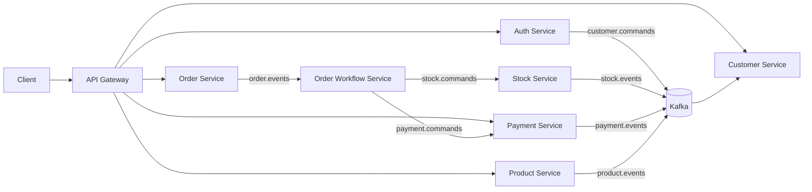

# Event-Driven E-Commerce Backend

Java 21 and Spring Boot 4.1.1 microservice backend for an event-driven e-commerce system. Each business service owns its PostgreSQL database; synchronous APIs use the Gateway and asynchronous workflows use Kafka.

The project demonstrates transactional Outbox/Inbox messaging, idempotent consumers, optimistic locking, Saga orchestration, compensation, Stripe Checkout, JWT authentication, ownership authorization, RBAC, service-level defense in depth, integration testing, and repeatable E2E flows.

## Architecture

### Business flow

```text
Cart → Checkout → Order Created → Stock Reserved
     → Payment Awaiting Customer → Payment Completed
     → Stock Confirmed → Order Confirmed → Cart Completed
```

Compensation paths:

```text
PAYMENT_EXPIRED → Payment FAILED → Reservation RELEASED
                → Order REJECTED → Cart ACTIVE → Saga FAILED

OUT_OF_STOCK    → Order REJECTED / OUT_OF_STOCK
                → Cart ACTIVE → Saga FAILED
```

### Service topology


```mermaid
flowchart LR
    Client --> Gateway[API Gateway]
    Gateway --> Auth[Auth Service]
    Gateway --> Customer[Customer Service]
    Gateway --> Product[Product Service]
    Gateway --> Order[Order Service]
    Gateway --> Payment[Payment Service]

    Auth -->|customer.commands| Kafka[(Kafka)]
    Kafka --> Customer
    Order -->|order.events| Workflow[Order Workflow Service]
    Workflow -->|stock.commands| Stock[Stock Service]
    Workflow -->|payment.commands| Payment
    Stock -->|stock.events| Kafka
    Payment -->|payment.events| Kafka
    Product -->|product.events| Kafka
```

| Service | Responsibility | Port |
| --- | --- | ---: |
| API Gateway | External HTTP entry point and routing | 4002 |
| Customer Service | Customer and address lifecycle | 4001 |
| Product Service | Product catalog | 4003 |
| Order Service | Cart, checkout, and order lifecycle | 4000 |
| Order Workflow Service | Order Saga orchestration and compensation | 4004* |
| Stock Service | Inventory and reservations | 4006 |
| Payment Service | Stripe Checkout and webhooks | 4007 |
| Auth Service | Registration, login, and JWT issuance | 4008* |

`*` Auth and Order Workflow ports are internal to Compose. Kafka is available on `9092`; Kafka UI is on `4005`.

## Reliability & Messaging

- Database-per-service with Flyway-owned schemas.
- Transactional Outbox and consumer Inbox for reliable, idempotent messaging.
- Kafka at-least-once delivery with idempotent consumers and `.DLT` topics.
- Optimistic locking for carts, stock, reservations, and Saga state.
- Saga orchestration with compensation instead of distributed rollback.
- Stock validates all requested items before mutating inventory.
- Stripe Checkout uses an order-based idempotency key; webhooks verify `Stripe-Signature`.

### Auth → Customer provisioning

Customer creation is asynchronous and is not a public `POST /customers` operation:

```text
POST /auth/register
  → AuthUser + CREATE_CUSTOMER_COMMAND Outbox in one transaction
  → Kafka customer.commands
  → Customer Inbox deduplication
  → Customer persisted
```

`AuthUser.id != Customer.id`. Customer Service owns its Customer UUID and stores the Auth identity as unique `Customer.authUserId`.

### Kafka topology

| Topic | Purpose |
| --- | --- |
| `customer.commands` | Auth-driven Customer provisioning |
| `product.events` | Product catalog events consumed by Stock |
| `order.commands` / `order.events` | Order commands and lifecycle events |
| `stock.commands` / `stock.events` | Stock reservation commands and results |
| `payment.commands` / `payment.events` | Payment commands and results |

Compose disables broker and consumer topic auto-creation. The `kafka-init` one-shot service runs [`infrastructure/kafka/init-topics.sh`](infrastructure/kafka/init-topics.sh), creates and verifies the configured topics/partitions, and completes before Kafka-dependent services start.

## Security & Authorization

### Authentication and JWT

Auth uses Spring Security password hashing and issues short-lived RS256 access tokens:

```text
issuer   = ecommerce-auth
audience = ecommerce-api
JWT.sub  = AuthUser.id
roles    = USER or ADMIN → ROLE_USER or ROLE_ADMIN
TTL      = 15 minutes
```

Public registration always creates `USER`; it does not accept or assign `ADMIN`. The Gateway validates signature, algorithm, issuer, audience, and timestamps before applying route policy. Customer, Order, Payment, and Product independently validate the same JWT contract with their own RSA public key.

Gateway policy is intentionally coarse:

- `POST /auth/register`, `POST /auth/login`, `GET /products/**`, and the Stripe webhook are public from the JWT perspective.
- Customer, Order, Cart, and Payment routes require authentication.
- Product mutations and `/admin/**` require `ROLE_ADMIN`.
- Unmatched routes are denied.

### Ownership and RBAC

```text
JWT.sub
  → AuthUser.id
  → Customer.authUserId
  → Customer.id
  → Cart.customerId / Order.customerId
```

| Resource | Normal access | ADMIN access |
| --- | --- | --- |
| Customer | Owner-scoped | `/admin/customers/**`: read/list/deactivate |
| Order | Owner-scoped | `/admin/orders/**`: read/list |
| Cart | Owner-scoped | `/admin/carts/**`: read-only |
| Payment | Owner through Order | None |
| Product | Public reads | Mutations require `ROLE_ADMIN` |

Customer and Order normal APIs remain owner-scoped even for ADMIN tokens. Foreign or unknown owned resources use not-found semantics. There is no admin address mutation, checkout, Cart mutation, or manual Order lifecycle API; lifecycle transitions remain Kafka/system-controlled.

### Internal ownership endpoints

These endpoints are JWT-protected at their target service, are not Gateway-routed, and exist only for current service-to-service ownership resolution:

```text
GET /internal/customer
GET /internal/orders/{orderId}/ownership
```

Order forwards the validated bearer token when resolving Customer ownership. Payment forwards the same bearer token to Order before performing a payment lookup.

### Payment and Stripe boundaries

```text
GET /payments/order/{orderId}
  → Payment validates JWT
  → Order verifies Order ownership
  → Payment lookup
```

Payment has no ADMIN API and does not directly resolve Customer. The response does not expose `providerPaymentId`.

```text
POST /payments/webhooks/stripe
  → no JWT required
  → Stripe-Signature verification required
```

Verified Stripe events remain idempotent and drive Payment state transitions and outbox processing.

### Product policy and compatibility boundary

```text
GET /products/**                 → public catalog reads
POST /products/bulk-lookup       → public at Product Service
POST /products                   → ROLE_ADMIN
PATCH /products/{id}             → ROLE_ADMIN
POST /products/{id}/deactivate   → ROLE_ADMIN
DELETE /products/{id}            → ROLE_ADMIN
```

`POST /products/bulk-lookup` is a read-only compatibility endpoint. Order calls Product directly without propagating a bearer token; the Gateway still treats non-GET `/products/**` as an ADMIN route. Product has no ownership layer.

Stock and Order Workflow are Kafka/system-oriented and expose no user-facing business HTTP API. Customer, Order, Payment, and Product independently enforce their relevant rules when accessed directly; the Gateway is not the only security boundary.

## Technology

Java 21 · Spring Boot 4.1.1 · Spring Cloud Gateway WebMVC · Spring Kafka · Spring Data JPA/Hibernate · PostgreSQL 16 · Flyway · Apache Kafka 4.1.1 · Stripe Java SDK 33.4.0 · Docker Compose · Testcontainers 2.0.5 · JUnit · Maven

## Running Locally

Prerequisites: Docker Compose, Maven, `make`, `curl`, and `jq`. Stripe CLI and macOS `open` are additionally required for Stripe E2E flows.

Create the uncommitted `payment-service/.env.local`:

```dotenv
STRIPE_SECRET_KEY=sk_test_<your-test-key>
STRIPE_WEBHOOK_SECRET=whsec_<listener-secret>
```

Create RSA keys outside the repository:

```text
~/.ecommerce-keys/private.pem
~/.ecommerce-keys/public.pem
```

Auth reads both keys. Gateway, Customer, Order, Payment, and Product receive only `public.pem`. Never commit credentials or private keys.

Start the stack:

```bash
docker compose up -d --build
```

The Gateway is available at `http://localhost:4002`. Compose starts Kafka, runs `kafka-init`, and then starts Kafka-dependent services only after topic initialization succeeds.

### Observability

Each service uses Spring Boot Actuator and Micrometer Tracing with the OpenTelemetry bridge and OTLP trace export to Tempo. Grafana provides trace search and dashboards; Prometheus scrapes `/actuator/prometheus` on the internal management ports. `spring.application.name` supplies each service's trace service name. HTTP tracing propagates W3C Trace Context through the Gateway and instrumented service clients; Kafka producer and listener observations continue context across event boundaries. Outbox records persist `traceparent` and `tracestate` so scheduled publishers preserve the originating context. Trace and span IDs are included in application log correlation fields.

The normal application sampling default is 10%; Docker Compose defaults to 100% for local trace verification. Set `TRACING_SAMPLING_PROBABILITY` to override either default. Grafana is available at `http://localhost:3000` and Prometheus at `http://localhost:9091`; management ports remain internal to Compose.

## Main API Surface

Representative Gateway routes:

```text
POST /auth/register
POST /auth/login

GET  /products
GET  /customers/{customerId}
GET  /admin/customers
GET  /carts/current
POST /carts/{cartId}/checkout
GET  /orders/{orderId}
GET  /admin/orders
GET  /admin/carts/{cartId}
GET  /payments/order/{orderId}
POST /payments/webhooks/stripe
```

Order calls `POST /products/bulk-lookup` directly at Product Service for catalog compatibility; it is not a public Gateway operation.

## End-to-End Testing

Reset the local stack before a new scenario:

```bash
make e2e-reset
```

The reusable bootstrap registers a unique Auth user, logs in through Gateway, captures a JWT, and polls asynchronous Customer provisioning:

```bash
bash -lc 'source scripts/e2e/common.sh && wait_for_gateway && bootstrap_e2e_customer'
```

### Out-of-stock

```text
Order REJECTED / OUT_OF_STOCK
Cart ACTIVE
Saga FAILED
```

See [`api-requests/README.md`](api-requests/README.md) and [`api-requests/08-out-of-stock-flow.http`](api-requests/08-out-of-stock-flow.http).

### Happy path

Start the Stripe listener, then run:

```bash
make stripe-listen
make e2e-happy
```

Complete the hosted Checkout with Stripe test card `4242 4242 4242 4242`. Expected result:

```text
Payment       COMPLETED
Reservation   CONFIRMED
Order         CONFIRMED
Cart          COMPLETED
Saga          COMPLETED
```

### Payment expiry

```bash
make e2e-reset
export STRIPE_SECRET_KEY=sk_test_<your-test-key>
make e2e-expiry
```

Expected result:

```text
Payment       FAILED
Reservation   RELEASED
Order         REJECTED / PAYMENT_EXPIRED
Cart          ACTIVE
Saga          FAILED
```

The Stripe listener forwards to `http://localhost:4002/payments/webhooks/stripe`. Copy its `whsec_...` value into `payment-service/.env.local`. E2E scripts use bounded polling and read-only development-state queries only where no public endpoint exists.

Manual IntelliJ HTTP flows are in [`api-requests/`](api-requests/); repeatable scripts are in [`scripts/e2e/`](scripts/e2e/).

## Testing

Coverage includes:

- Domain, web, persistence, Flyway, and Testcontainers integration tests.
- Kafka routing, transactional Outbox/Inbox, idempotency, rollback, and optimistic locking.
- Saga orchestration, compensation, and stock validation.
- JWT signature/issuer/audience/expiration validation, ownership, RBAC, internal endpoints, and direct service enforcement.
- Stripe signature verification, Payment ownership, bearer propagation, and webhook idempotency.
- Out-of-stock, happy-path, and payment-expiry E2E scenarios.

Run the multi-module suite with Docker available for Testcontainers:

```bash
mvn test
```

## Current State

- Core event-driven commerce flow is implemented and locally verifiable.
- Auth JWT, Gateway authorization, Customer/Order ownership, ADMIN RBAC, Payment ownership, Stripe webhook verification, and Product RBAC are implemented.
- Reliability behavior includes Outbox/Inbox messaging, idempotency, optimistic locking, Saga compensation, and deterministic Kafka initialization.
- Integration tests and repeatable E2E scripts cover the main success and failure paths.

This is a development/portfolio project, not a production-scale performance claim.

## Next Steps

- **Reliability:** Multi-instance Outbox publisher claiming/hardening.
- **Performance:** k6 load/stress testing with p95/p99 characterization.
- **Security hardening:** Refresh/revocation, JWKS/key rotation, MFA, and rate limiting.
- **Optional capability:** Notification service.
